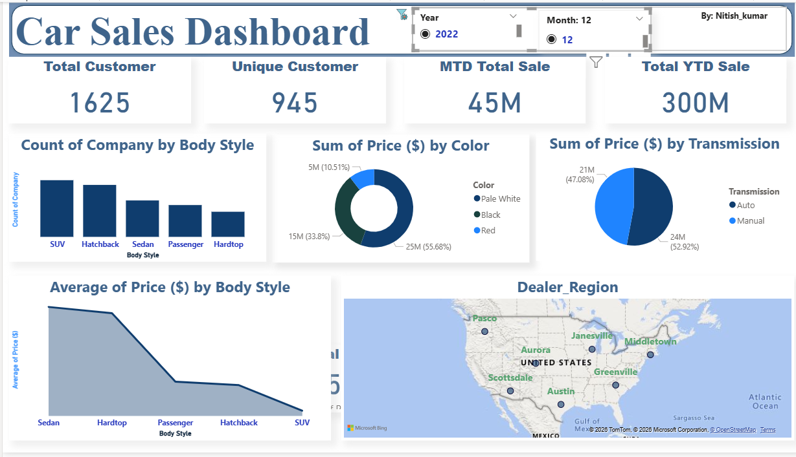
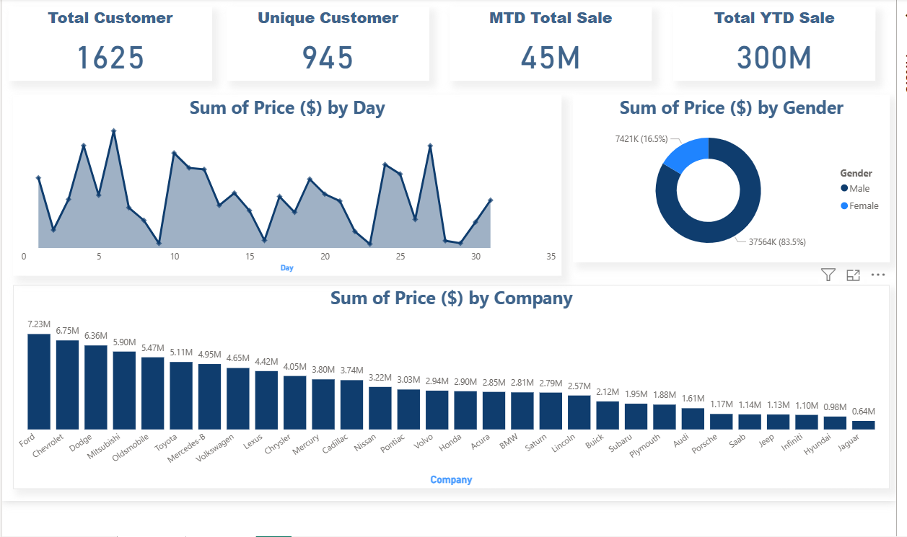

# Power-Bi-Project

# 🚗 Car Sales Dashboard | Power BI

## 📌 Project Overview
This project presents an **interactive Car Sales Dashboard** built using **Power BI** to analyze car sales performance across multiple business dimensions such as time, customer behavior, vehicle attributes, and geographic regions.  
The dashboard enables stakeholders to quickly track KPIs, identify trends, and make data-driven decisions.

---

## 🎯 Objectives
- Monitor **overall sales performance** using key KPIs
- Analyze sales trends by **Day, Month, and Year**
- Understand **customer segmentation and buying patterns**
- Compare sales performance across **companies, body styles, and regions**
- Enable **dynamic filtering and drill-down analysis**

---

## 📊 Key KPIs
- **Total Customers**
- **Unique Customers**
- **MTD (Month-to-Date) Total Sales**
- **YTD (Year-to-Date) Total Sales**
- **Total Sales Value**
- **Car Count**

---

## 📈 Dashboard Features
- **Count of Company by Body Style** (SUV, Sedan, Hatchback, Passenger, Hardtop)
- **Sum of Price by Color** (Donut Chart)
- **Sum of Price by Transmission Type** (Auto vs Manual)
- **Average Price by Body Style**
- **Daily Sales Trend Analysis**
- **Company-wise Sales Comparison**
- **Dealer Region Map Visualization**

---

## 🎛️ Interactive Filters (Slicers)
- **Year**
- **Month**
- **Gender**

These slicers allow users to dynamically filter data and perform deeper analysis with ease.

---

## 🛠️ Tools & Technologies Used
- **Power BI**
- **DAX** (Calculated Measures & KPIs)
- **Data Modeling**
- **Data Cleaning & Transformation**
- **Interactive Visualizations**

---

## 📌 Business Insights
- Identified **top-performing car companies** and **body styles**
- Analyzed **customer purchase behavior** by gender
- Tracked **sales trends over time** for strategic planning
- Enabled **region-wise sales monitoring** using map visuals

---

## 📂 Project Files
- Power BI Dashboard (`.pbix`)
- Supporting datasets (if included)
- Dashboard images for preview

---

## 👤 Author
**Nitish Kumar**  

Aspiring Data Analyst | Power BI | SQL | Python  
📍 India  
🔗 GitHub: https://github.com/Nitishkumar50814

---

--

---
